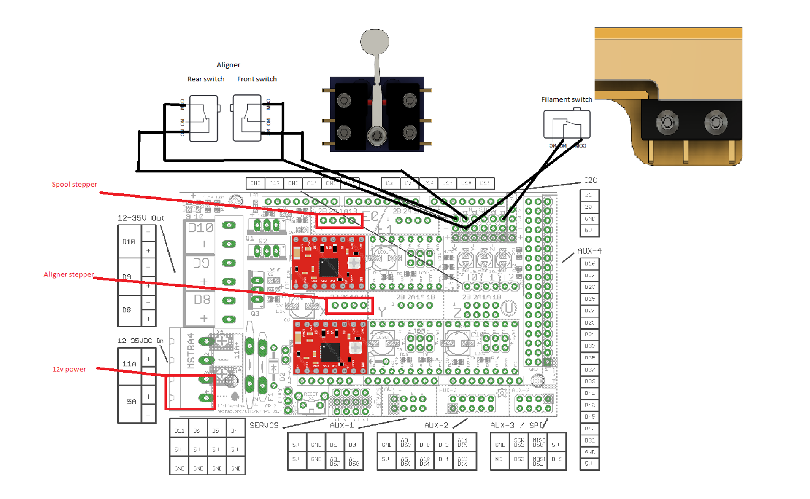

# Rewinder
3D Printer Filament Rewinder

## Hardware

Following is the list of main board components:

[ATmega 2560 Arduino board](https://www.amazon.com/ELEGOO-ATmega2560-ATMEGA16U2-Projects-Compliant/dp/B01H4ZLZLQ/ref=sr_1_1?crid=MJI93N5YIZO5&keywords=ATmega+2560&qid=1667758576&sprefix=atmega+2560%2Caps%2C135&sr=8-1)

[RAMPS 1.4](https://www.amazon.com/dp/B07ZNFMCSR?psc=1&ref=ppx_yo2ov_dt_b_product_details)

[Full Graphics Display](https://www.amazon.com/Aokin-Graphic-Display-Controller-Adapter/dp/B07PF297YD/ref=sr_1_1?crid=UMTWKYOIMVSU&keywords=reprap+full+graphics+controller&qid=1667761390&sprefix=reprap+full+graphics+controller%2Caps%2C154&sr=8-1)

[12v Power Supply](https://www.amazon.com/dp/B00FRBMV3Q?psc=1&ref=ppx_yo2ov_dt_b_product_details)

[Power switch receptacle](https://www.amazon.com/dp/B08F331VD2?psc=1&ref=ppx_yo2ov_dt_b_product_details)

## Getting Started

This project uses the `ATmega 2560 Arduino board`

For this project, we recommend that you use `Visual Studio Code`.

Install [Auto Build Marlin](https://marlinfw.org/docs/basics/auto_build_marlin.html#installation)

## Original

[Automatic Filament Rewinder (Runs on Marlin)](https://www.printables.com/model/303944-automatic-filament-rewinder-runs-on-marlin)

## Parts List

[M3 square nuts](https://www.amazon.com/dp/B06XPFLNBS?psc=1&ref=ppx_yo2ov_dt_b_product_details)

[Power switch receptacle](https://www.amazon.com/dp/B08F331VD2?psc=1&ref=ppx_yo2ov_dt_b_product_details)

[Cable chain](https://www.amazon.com/Befenybay-Internal-Flexible-Machines-7mmX7mm/dp/B07TGBD2GT/ref=sr_1_1?crid=3BJ0FZ1WG5SL7&keywords=7x7+cable+chain&qid=1667758423&s=industrial&sprefix=7x7+cable+chain%2Cindustrial%2C138&sr=1-1)

[RAMPS 1.4](https://www.amazon.com/dp/B07ZNFMCSR?psc=1&ref=ppx_yo2ov_dt_b_product_details)

[ATmega 2560 Arduino board](https://www.amazon.com/ELEGOO-ATmega2560-ATMEGA16U2-Projects-Compliant/dp/B01H4ZLZLQ/ref=sr_1_1?crid=MJI93N5YIZO5&keywords=ATmega+2560&qid=1667758576&sprefix=atmega+2560%2Caps%2C135&sr=8-1)

[Full Graphics Display](https://www.amazon.com/Aokin-Graphic-Display-Controller-Adapter/dp/B07PF297YD/ref=sr_1_1?crid=UMTWKYOIMVSU&keywords=reprap+full+graphics+controller&qid=1667761390&sprefix=reprap+full+graphics+controller%2Caps%2C154&sr=8-1)

[Bearings](https://www.amazon.com/dp/B07JJ526NX?psc=1&ref=ppx_yo2ov_dt_b_product_details)

[NEMA 17 stepper motors](https://www.amazon.com/dp/B00PNEQKC0?psc=1&ref=ppx_yo2ov_dt_b_product_details)

[Power Supply](https://www.amazon.com/dp/B00FRBMV3Q?psc=1&ref=ppx_yo2ov_dt_b_product_details)

[Stepper Coupler](https://www.amazon.com/dp/B07JL1QYLS?psc=1&ref=ppx_yo2ov_dt_b_product_details)

[M8 200mm Threaded Rod](https://www.amazon.com/dp/B07PQ1487H?ref=ppx_yo2ov_dt_b_product_details&th=1)

Micro Switches

NOTE: I did have one user report that these micro switches take too much force to engage and end up breaking the trigger arm. You may want to source these Omron switches available on DigiKey.

[Micro Switches (DigiKey)](https://www.digikey.com/en/products/detail/omron-electronics-inc-emc-div/SS-5/369869)

[Micro Switches (Amazon)](https://www.amazon.com/dp/B0B7DD5SF1?psc=1&ref=ppx_yo2ov_dt_b_product_details)

## Wiring

Following is the wiring for the stepper motors and limit switches.

